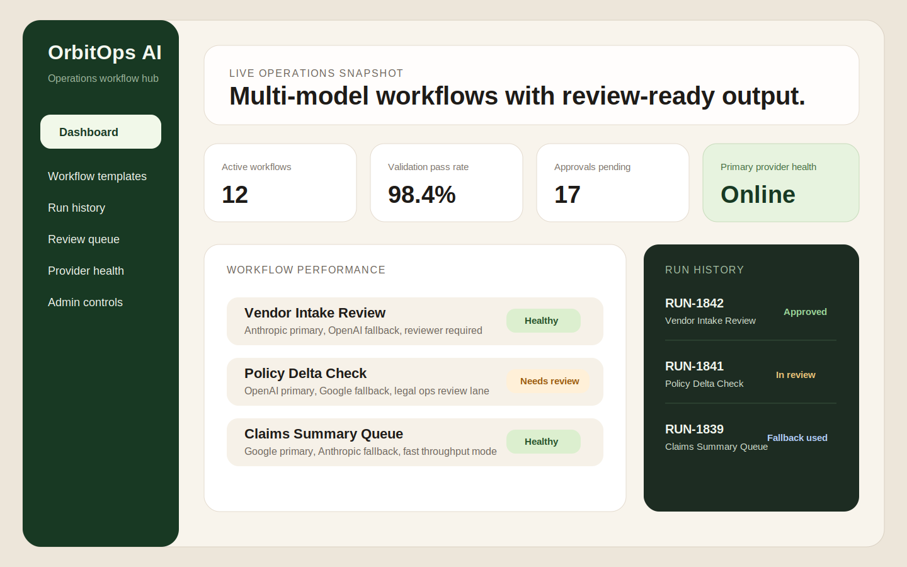
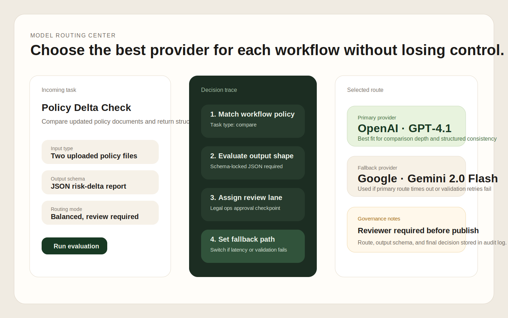
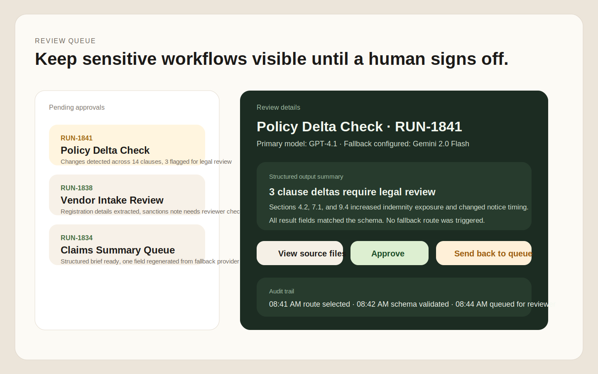

# OrbitOps AI

OrbitOps AI is a private product-style repository for a multi-AI operations workflow platform built for teams that process documents, internal requests, and repeatable knowledge work through one governed system.

The project is intentionally similar to the kind of platform a client would request for multi-model AI orchestration, but it is framed as a stronger prior-client solution with a clearer operations focus, human review checkpoints, and better traceability across every run.

## Product Overview

OrbitOps AI combines workflow submission, file intake, model routing, structured outputs, and review queues into a single workspace. Teams can upload source files, choose a workflow, send tasks through the orchestration layer, and review validated results before they are approved for downstream use.

## Core Capabilities

- Multi-provider AI routing by workflow type, latency target, and output requirements
- Team workspaces with account-based access and run history
- Structured outputs for extraction, classification, comparison, drafting, and summarization workflows
- File upload and processing support for operational documents
- Human review and approval checkpoints for sensitive or business-critical tasks
- Logging, fallback behavior, and auditability across task execution

## Architecture Direction

- `apps/web`: Next.js application for authentication, dashboard views, workflow submission, file upload, run history, and review queues
- `services/api`: Python orchestration service for provider adapters, prompt handling, routing logic, structured output validation, retries, and fallbacks
- `packages/shared`: shared contracts for workflow definitions, result schemas, and API payload shapes

## Included Starter Project

This repository now includes a real starter scaffold instead of documentation only:

- a multi-page Next.js operations workspace in `apps/web`
- a FastAPI routing and run-simulation service in `services/api`
- shared workflow seed data in `packages/shared`

The current implementation is intentionally lightweight, but it gives the project a usable starting point for a real product build.

## Implemented Product Areas

- overview dashboard with live workflow and run metrics
- workflow template library with route and review settings
- run history screen with provider visibility
- review queue screen for human approval checkpoints
- new run screen for structured workflow submission
- API routes for dashboard data, workflow lists, runs, providers, review queue, routing, and simulated execution

## Product Screens

These visuals are based on the actual OrbitOps product structure in this repo. They are meant to help a new client understand the dashboard, routing logic, and human review flow quickly.

### Dashboard Overview

Shows the main operations workspace with workflow health, run history, and live metrics.



### Routing Center

Shows how a workflow is evaluated, how the model route is selected, and how fallback and governance rules are applied.



### Review Queue

Shows the approval flow for sensitive runs, including structured output review and audit history.



## Local Development

### Web

```bash
npm install
npm run dev:web
```

### API

```bash
cd services/api
python3 -m venv .venv
source .venv/bin/activate
pip install -r requirements.txt
uvicorn main:app --reload
```

The API exposes:

- `GET /dashboard`
- `GET /workflows`
- `GET /runs`
- `GET /review`
- `GET /providers`
- `POST /route`
- `POST /runs/simulate`

## Why This Project Exists

This repository is meant to represent a credible, real-world platform from a previous engagement rather than a direct copy of a current lead. It is designed to show a more mature product direction with workflow templates, model governance, performance logging, and approval steps built into the system from the start.

## Repository Status

This repository is private and intended for controlled development and portfolio-style project packaging only.

## License

Private and proprietary. All rights reserved.
